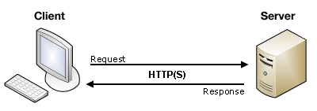

# Le protocole HTTP

----

## Définition

HTTP (Hypertext Transfer Protocol) est un protocole de communication client-serveur développé pour le World Wide Web. Il est utilisé pour échanger toute sorte de données entre client HTTP et serveur HTTP.

Il s'agit d'un protocole **sans état**, ce qui signifie que le serveur ne conserve aucune donnée entre deux requêtes



----

## Les méthodes de requêtes (ou verbes) HTTP

HTTP définit un [ensemble de méthodes](https://developer.mozilla.org/fr/docs/Web/HTTP/M%C3%A9thode) de requête qui indiquent l'action que l'on souhaite réaliser sur la ressource indiquée.

- **GET** : demande une représentation de la ressource spécifiée. Les requêtes GET doivent uniquement être utilisées afin de récupérer des données
- **HEAD** : demande une réponse identique à une requête GET pour laquelle on aura omis le corps de la réponse
- **POST** : est utilisée pour envoyer une entité vers la ressource indiquée. Cela  entraîne généralement un changement d'état ou des effets de bord sur le serveur
- **PUT** : remplace toutes les représentations actuelles de la ressource visée par le contenu de la requête
- **DELETE** : supprime la ressource indiquée
- **CONNECT** : établit un tunnel vers le serveur identifié par la ressource cible
- **OPTIONS** : est utilisée pour décrire les options de communications avec la ressource visée.
- **TRACE** : éalise un message de test aller/retour en suivant le chemin de la ressource visée
- **PATCH** : est utilisée pour appliquer des modifications partielles à une ressource

----

## La requête HTTP

```http
Méthode, URL, Version du protocole
En-têtes de requête

Corps de requête
```

- Méthode : précise le type de requête (HEAD, GET, POST...)
- URL : adresse de la page sur le serveur
- Version du protocole HTTP
- il y a plusieurs en-tête sous la forme `clé: valeur` 
    - [liste des headers](https://developer.mozilla.org/fr/docs/Web/HTTP/Headers)
    - **Host** spéficie le nom de domaine du site
    - **Cookie** permet d'envoyer au serveur les cookies qui ont été enregistrés sur l'ordinateur du client à la demande du serveur. Les cookies sont des fichiers textes contenant des informations sur la navigation effectuée sur les pages du site.
    - **Content-Type** spécifie le type MIME du corps de la requête
    - **Content-Length** spécifie la longueur du corps de la requête
    - **Accept** spécifie le type de contenu accepté par le client (par exemple text/html)
- le corps de la requête peut contenir le contenu d'un formulaire HTML passé en POST sous la forme `variable1=valeur1&variable2=valeur2`

----

## Exemple de requête HTTP

```http
GET / HTTP/1.1
Host: developer.mozilla.org
Accept-Language: fr

POST / HTTP/1.1
Host: foo.com
Content−Type: application/x−www−form−urlencoded
Content−Length: 13
say=Hi&to=Mom
```

Dans une requête POST, il faut spécifier le type de données. Pour un formulaire HTML, il y a 2 valeurs possibles :
- application/x-www-form-urlencoded (valeur par défaut)
- multipart/form-data (utilisé pour le download de fichiers)

Il faut également spécifier la longueur du corps.

----

## La réponse HTTP

```http
Version, Code-réponse, Texte-réponse
En-tête de réponse

Corps de réponse
```
- Version HTTP du serveur
- Code-réponse : le code retournée, par exemple 200, 404, 500
- Texte-réponse : le texte associé par exemple “OK”, “NOT FOUND”, “INTERNAL ERROR”
- les en-têtes :
    - **Date** : date de génération de la réponse
    - **Server** : spécifie le modèle du serveur HTTP
    - **Set-Cookie** : demande au navigateur d'enregistrer un cookie
- le corps de la réponse contient le contenu du fichier, par exemple HTML

----

## Exemple de réponse HTTP

```http
HTTP/1.1 200 OK
Date: Sat, 09 Oct 2010 14:28:02 GMT
Server: Apache
Last-Modified: Tue, 01 Dec 2009 20:18:22 GMT
ETag: "51142bc1-7449-479b075b2891b"
Accept-Ranges: bytes
Content-Length: 29769
Content-Type: text/html

<!DOCTYPE html... (suivi des 29769 octets de la page web demandée)
```

----

## Les codes de statut de réponse HTTP

[documentation Mozilla](https://developer.mozilla.org/fr/docs/Web/HTTP/Status)
- 1xx : information
- 2xx : succès
- 3xx : redirection
- 4xx : erreur du client
- 5xx : erreur su serveur

----

## L'en-tête Content-Type

- l'en-tête HTTP **content-type** :
- permet au client d'avoir plus d'informations sur ce qu'il reçoit, par exemple `text/html` pour du HTML, `text/plain` pour du texte brut, `application/pdf`pour du PDF, `application/json` pour des données au format JSON, `application/xml` pour des données au format XML. On parle de **type MIME** [liste des types MIME](https://developer.mozilla.org/fr/docs/Web/HTTP/Basics_of_HTTP/MIME_types/Complete_list_of_MIME_types)
- permet aussi de préciser le jeu de caractères (**charset**) que le navigateur doit utiliser pour afficher le contenu. Par défaut, il s'agit du jeu de caractères *ISO-8859-1* nommé aussi *Latin-1*.

La bonne pratique est d'utiliser l'UTF-8 comme encodage des fichiers contenant le code source et comme jeu de caractères en-tête de la réponse HTTP. Exemple pour ajouter des en-têtes en Java :
```java
response.setContentType("text/html");

response.setContentType("text/html;charset=UTF-8");

response.setContentType("text/html");
response.setCharacterEncoding("UTF-8");
```

----

## Structure d'une requête HTTP

TODO
- pathparam, queryparam avec les ? et &