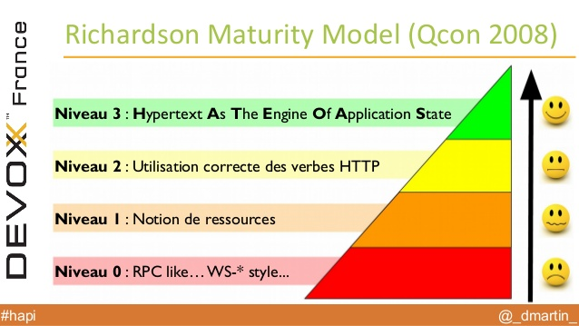

# Architecture

----

## L'architecture REST

- 2 grands types d'architectures pour les API :
    - **SOAP** (Simple Object Access Protocol) dévelopé par Microsoft 
    - **REST** créé en 2000 par Roy Fielding dans sa thèse

REST :
- doit être sans état, ou **stateless** en anglais : aucune donnée n'est conservée par le serveur entre 2 requêtes. Cela peut permettre de traiter les requêtes via des instances de multiples serveurs

----

## L'architecture classique d'une application web à l'Insee

---- 

## La nouvelle architecture avec un 'front-ent' JavaScript et une API Java pour le 'back-end'

----

## Intérêts : rapidité, partage d'informations instantané entre applications
